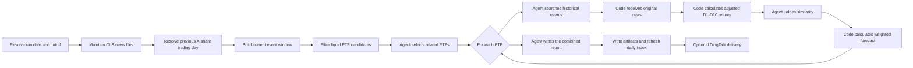

# Auto Fin Cookbook

[中文](README_ZH.md)

Auto Fin is a local-first, file-native ETF event-research workflow. It identifies market events in CLS news, selects
related liquid ETFs, studies similar historical events and subsequent returns, and produces a Chinese research report.

> Auto Fin provides event research and holding-period references only. It is not investment advice, does not
> connect to a broker, and does not place or simulate trades.

## Capabilities

- Download CLS news through Tushare and maintain up to 360 days of traceable local news records.
- Rank ETF candidates by previous-trading-day turnover, then select representative ETFs related to current events.
- Search ReMe memory and local news files for similar historical events, with strict source-path and news-ID checks.
- Calculate adjusted D1–D10 historical returns in deterministic code instead of asking an Agent to invent numbers.
- Let an Agent judge event similarity, then calculate weights, expected returns, and a reference holding period in code.
- Save readable Markdown and structured JSON/JSONL artifacts, refresh the daily index, and optionally deliver the report
  to DingTalk.

The workflow is assembled by
[`daily_cookbook.yaml`](../../reme/config/daily_cookbook.yaml). Its public schemas are in
[`reme/schema/auto_fin.py`](../../reme/schema/auto_fin.py), and its steps are in
[`reme/steps/cookbook/auto_fin/`](../../reme/steps/cookbook/auto_fin/).

## Quick start

Auto Fin requires Python 3.11 or newer, the `core` dependencies, a Tushare token, and credentials for the configured
Claude Code-compatible endpoint.

From the repository root:

```bash
python -m pip install -e ".[core]"
export TUSHARE_TOKEN="your-tushare-token"
export CLAUDE_CODE_API_KEY="your-api-key"
reme start config=daily_cookbook job=auto_fin
```

The built-in configuration uses `qwen3.7-max` through DashScope's Anthropic-compatible endpoint. Override these
variables to use another compatible model or provider:

```bash
export CLAUDE_CODE_MODEL_NAME="your-model"
export CLAUDE_CODE_BASE_URL="https://your-anthropic-compatible-endpoint"
```

The default workspace is `reme_workspace/`. This standalone cookbook shares its workspace setting with the daily-paper
workflow:

```bash
export DAILY_PAPER_WORKSPACE_DIR="/absolute/path/to/reme-workspace"
```

To deliver the final Markdown report to DingTalk, set:

```bash
export DINGTALK_APP_KEY="your-app-key"
export DINGTALK_APP_SECRET="your-app-secret"
export DINGTALK_ROBOT_CODE="your-robot-code"
export DINGTALK_CONVERSATION_IDS="conversation-id-1,conversation-id-2"
```

DingTalk delivery is skipped when the required values are empty.

Dates and times use `Asia/Shanghai`. The optional `date` must be the current date:

```bash
reme start config=daily_cookbook job=auto_fin date=2026-07-25
```

To refresh every configured news day instead of reusing valid historical files:

```bash
reme start config=daily_cookbook job=auto_fin force=true
```

This may issue many Tushare requests. A normal run reuses valid historical news files and always refreshes today's file.

### Optional SSH proxy

The outbound proxy is disabled by default. To enable it, uncomment `components.outbound_proxy.default` in
`daily_cookbook.yaml`, configure non-interactive SSH authentication, and set:

```bash
export REME_PROXY_IP="your-ssh-proxy-host"
export REME_PROXY_ACCOUNT="your-ssh-account"
```

## How it works



The top-level job contains four Auto Fin steps:

| Step                    | Responsibility                                              | Agent |
|-------------------------|-------------------------------------------------------------|-------|
| `auto_fin_data_step`    | Maintain news files and resolve the previous trading day    | No    |
| `auto_fin_topic_step`   | Build inputs and select related ETFs and current events     | Yes   |
| `auto_fin_history_step` | Orchestrate historical research and market analysis per ETF | Yes   |
| `auto_fin_merge_step`   | Validate results and produce the final Markdown report      | Yes   |

For each selected ETF, `auto_fin_history_step` dispatches:

- `auto_fin_history_search_step`, which asks the Agent for historical news references and then resolves the original
  records and calculates their returns in code.
- `auto_fin_market_step`, which asks the Agent only for similarity judgments and then calculates weights and forecasts
  in code.

Agents handle semantic judgments; deterministic code handles source validation and financial calculations.

## Data and time boundaries

### News history

`auto_fin_data_step` reads CLS news from Tushare's `major_news` endpoint:

- The default lookback is 360 calendar days, including the run date.
- A valid historical file is reused unless `force=true`.
- Today's file is refreshed through the current `decision_at` on every run.
- Large responses are fetched through recursively split time windows.
- Records are ordered and deduplicated before being written with a stable `news_id`.

The current event window is:

```text
(previous A-share trading day at 15:00, decision_at]
```

Each run rebuilds this complete window; midday and evening runs do not use only the increment since the previous run.

### ETF candidates

The candidate universe combines:

- `etf_basic` for currently listed ETFs and their tracked indexes.
- `fund_daily` for turnover on the previous A-share trading day.

Code sorts candidates by turnover, removes duplicates by ETF name and index identity, and provides at most 150
candidates to the Topic Agent. The Agent may return at most 20 ETFs and must copy every ETF code, name, and news ID from
the generated candidate files.

Turnover is used only to narrow the research universe; it is not a trading signal.

## Historical research and forecasting

### Source resolution

The History Agent searches by event type, entities, transmission mechanism, and expected direction. It first uses
`memory_search` and may then scan:

```text
daily/YYYY-MM-DD/auto_fin_news_data.jsonl
```

Its output contains only a reason, `news_id`, and workspace-relative `source_path`. Code rejects:

- Current-window news presented as historical evidence.
- Absolute paths, `..` traversal, or paths outside the workspace.
- Sources not named `auto_fin_news_data.jsonl`.
- Missing files or IDs that do not resolve exactly once.
- Records without a usable publication time, title, or body.

Historical Markdown may guide retrieval, but the original news JSONL is the source of truth.

### Adjusted returns

For every resolved historical event, code reads `fund_daily` and `fund_adj` and calculates up to ten future closes:

- Before 09:30 on a trading day: enter at that day's open.
- From 09:30 until before 15:00: enter at that day's close.
- At or after 15:00, or on a non-trading day: enter at the next trading day's open.
- A daily close later than the current `decision_at` is excluded.

```text
adjusted_entry = raw_entry × entry_adjustment_factor
adjusted_close = raw_close × close_adjustment_factor
cumulative_return = adjusted_close / adjusted_entry - 1
```

Missing prices, factors, trading days, or horizons become explicit limitations. They are never filled with Agent-made
values.

### Similarity and forecast

The Market Agent returns semantic similarity in `[-1, 1]`:

- Positive values mean a similar mechanism and direction.
- Negative values mean a comparable mechanism but opposite direction.
- Zero means no useful relationship.

Code clamps out-of-range values, ignores zero-similarity events, normalizes weights from absolute similarity, and
reverses the historical return direction for negative matches. Each D1–D10 horizon is calculated from the samples
available at that horizon. The suggested holding period is the positive-return horizon with the highest expected return,
or empty when none is positive.

The result also records limited samples, missing horizons, conflicting return directions, and other data limitations. It
is a comparison with a small historical sample, not evidence of statistical significance.

## Output layout

```text
reme_workspace/
├── daily/
│   ├── YYYY-MM-DD.md
│   └── YYYY-MM-DD/
│       ├── auto_fin_news_data.jsonl
│       ├── auto_fin_analysis.jsonl
│       └── auto_fin.md
└── resource/
    └── YYYY-MM-DD/
        ├── filtered_news.jsonl
        ├── filtered_etf.jsonl
        ├── auto_fin_topic_output.jsonl
        ├── auto_fin_history_<index>_<ETF-code>_output.json
        ├── auto_fin_market_<index>_<ETF-code>_output.json
        ├── auto_fin_history_output.jsonl
        └── auto_fin_merge_output.json
```

Important artifacts:

- `auto_fin_news_data.jsonl` is the user-owned source used to resolve historical news.
- `filtered_news.jsonl` and `filtered_etf.jsonl` are bounded inputs for the Topic Agent.
- Per-ETF history files contain resolved source news and code-calculated return paths.
- Per-ETF market files contain code-calculated matches, weights, and D1–D10 forecasts.
- `auto_fin_analysis.jsonl` contains the final structured analysis for every selected ETF.
- `auto_fin.md` is the readable report and DingTalk payload.
- `daily/YYYY-MM-DD.md` is refreshed after report generation so the report is discoverable from the daily index.

News and reports remain ordinary user-owned files. Resource artifacts and search indexes can be rebuilt.

## Configuration

### Job parameters

| Parameter |      Default | Meaning                                                 |
|-----------|-------------:|---------------------------------------------------------|
| `date`    | Current date | Strict `YYYY-MM-DD`; only the current date is supported |
| `force`   |      `false` | Refresh all configured news days                        |

### Environment variables

| Variable                    | Required | Meaning                                                 |
|-----------------------------|----------|---------------------------------------------------------|
| `TUSHARE_TOKEN`             | Yes      | News, calendar, ETF daily data, and adjustment factors  |
| `CLAUDE_CODE_API_KEY`       | Yes      | Auto Fin Agent credentials                              |
| `CLAUDE_CODE_MODEL_NAME`    | No       | Defaults to `qwen3.7-max`                               |
| `CLAUDE_CODE_BASE_URL`      | No       | Anthropic-compatible endpoint                           |
| `AUTO_FIN_AGENT_BACKEND`    | No       | Defaults to `claude_code`                               |
| `AUTO_FIN_PROJECT_PATH`     | No       | Agent project path; defaults to `..`                    |
| `REME_PROXY_IP`             | No       | SSH proxy host; used only when `ssh_http` is enabled    |
| `REME_PROXY_ACCOUNT`        | No       | SSH proxy account; used only when `ssh_http` is enabled |
| `DAILY_PAPER_WORKSPACE_DIR` | No       | Standalone cookbook workspace                           |
| `DINGTALK_*`                | No       | DingTalk application, robot, and conversation settings  |

Unit tests can inject `tushare_provider` through the runtime context and do not require real credentials.

### Scheduled jobs

`daily_cookbook.yaml` defines:

| Job                  | Cron          | Asia/Shanghai  |
|----------------------|---------------|----------------|
| `auto_fin_0930_cron` | `30 9 * * *`  | Daily at 09:30 |
| `auto_fin_1145_cron` | `45 11 * * *` | Daily at 11:45 |
| `auto_fin_1800_cron` | `0 18 * * *`  | Daily at 18:00 |

These cron expressions do not exclude weekends or market holidays. The workflow resolves the previous A-share trading
day but does not currently skip a run merely because the run date is not a trading day.

## Agent and security boundaries

The Auto Fin wrapper loads the `tushare-data` skill, exposes the `memory_search` job tool, and defaults to
`bypassPermissions`. Prompts constrain each Agent's role, while code revalidates schemas, ETF identities, source paths,
news references, and calculated values.

The standalone cookbook does not configure an embedding store by default, so `memory_search` normally uses BM25 recall.
Vector and BM25 fusion becomes available only when an embedding store is configured.

`bypassPermissions` is not an operating-system sandbox. Review the configured project path, workspace, credentials, and
network boundary before deployment.

## Reruns and limitations

- Valid historical news files are reused; today's news is always refreshed.
- Outputs use stable per-day paths, so a later same-day run replaces the previous report and resource outputs.
- Auto Fin intentionally has no “report exists, skip” shortcut because its scheduled runs analyze updated news.
- Every successful run attempts DingTalk delivery when configured; notification deduplication is not implemented.
- Missing historical market horizons degrade one sample and are recorded as limitations.
- Invalid dates, missing required services, invalid Agent schemas, unknown ETFs or news IDs, unsafe paths, and
  inconsistent cross-step ETF identities fail the job.

The current implementation does not include stocks, US-market correlation, portfolio accounting, BUY/SELL/HOLD actions,
T+1 execution rules, fees, slippage, broker integration, or real/simulated order execution.

## Development

Install development dependencies and run the focused suite:

```bash
python -m pip install -e ".[dev,core]"
PYTHONPATH=. pytest tests/unit/test_auto_fin.py -v
```

The unit suite mocks model and market-data boundaries. Tests requiring real Tushare, model, or DingTalk credentials
should be run separately and only with explicit authorization.
