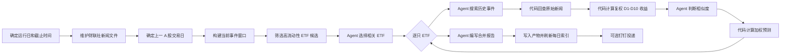

# Auto Fin Cookbook

[English](README.md)

Auto Fin 是一个本地优先、文件原生的 ETF 事件研究工作流。它从财联社新闻中识别市场事件，选择相关且流动性较好的
ETF，研究相似历史事件及其后续收益，并生成中文研究报告。

> Auto Fin 只提供事件研究和持有时间参考，不构成投资建议。当前实现不连接券商、不提交委托，也不执行模拟交易。

## 能力

- 通过 Tushare 获取财联社新闻，并维护最多 360 天可追溯的本地新闻记录。
- 按上一交易日成交额筛选 ETF 候选，再选择与当前事件直接相关的代表性 ETF。
- 通过 ReMe 记忆检索和本地新闻文件查找相似历史事件，并严格校验来源路径和新闻 ID。
- 由确定性代码计算复权后的 D1–D10 历史收益，不让 Agent 编造行情数值。
- 由 Agent 判断事件相似度，再由代码计算权重、预期收益和参考持有时间。
- 保存可读 Markdown 和结构化 JSON/JSONL，刷新每日索引，并支持可选钉钉投递。

工作流由 [`daily_cookbook.yaml`](../../reme/config/daily_cookbook.yaml) 装配，公共 schema 位于
[`reme/schema/auto_fin.py`](../../reme/schema/auto_fin.py)，各步骤位于
[`reme/steps/cookbook/auto_fin/`](../../reme/steps/cookbook/auto_fin/)。

## 快速开始

Auto Fin 要求 Python 3.11 或更高版本、`core` 依赖、Tushare token，以及所配置 Claude Code 兼容 endpoint 的凭据。

在仓库根目录运行：

```bash
python -m pip install -e ".[core]"
export TUSHARE_TOKEN="your-tushare-token"
export CLAUDE_CODE_API_KEY="your-api-key"
reme start config=daily_cookbook job=auto_fin
```

内置配置默认通过 DashScope 的 Anthropic 兼容 endpoint 使用 `qwen3.7-max`。如需更换兼容模型或服务商：

```bash
export CLAUDE_CODE_MODEL_NAME="your-model"
export CLAUDE_CODE_BASE_URL="https://your-anthropic-compatible-endpoint"
```

默认 workspace 是 `reme_workspace/`。该 standalone cookbook 与每日论文工作流共用 workspace 配置：

```bash
export DAILY_PAPER_WORKSPACE_DIR="/absolute/path/to/reme-workspace"
```

如需把最终 Markdown 报告发送到钉钉：

```bash
export DINGTALK_APP_KEY="your-app-key"
export DINGTALK_APP_SECRET="your-app-secret"
export DINGTALK_ROBOT_CODE="your-robot-code"
export DINGTALK_CONVERSATION_IDS="conversation-id-1,conversation-id-2"
```

相关配置为空时会跳过钉钉投递。

日期和时间均使用 `Asia/Shanghai`。可选的 `date` 必须是当天：

```bash
reme start config=daily_cookbook job=auto_fin date=2026-07-25
```

如需刷新全部新闻日期，而不是复用有效历史文件：

```bash
reme start config=daily_cookbook job=auto_fin force=true
```

这可能产生大量 Tushare 请求。普通运行会复用有效历史新闻，并始终刷新当天文件。

### 可选 SSH 代理

出站代理默认关闭。如需启用，请取消 `daily_cookbook.yaml` 中
`components.outbound_proxy.default` 的注释，配置免交互 SSH 认证，并设置：

```bash
export REME_PROXY_IP="your-ssh-proxy-host"
export REME_PROXY_ACCOUNT="your-ssh-account"
```

## 工作原理



顶层 Job 包含四个 Auto Fin Step：

| Step                    | 职责                              | Agent |
|-------------------------|-----------------------------------|-------|
| `auto_fin_data_step`    | 维护新闻文件并确定上一交易日      | 否    |
| `auto_fin_topic_step`   | 构建输入并选择相关 ETF 和当前事件 | 是    |
| `auto_fin_history_step` | 逐只 ETF 编排历史研究和行情分析   | 是    |
| `auto_fin_merge_step`   | 校验结果并生成最终 Markdown 报告  | 是    |

对于每只已选 ETF，`auto_fin_history_step` 会派发：

- `auto_fin_history_search_step`：Agent 返回历史新闻引用，然后由代码解析原始记录并计算收益。
- `auto_fin_market_step`：Agent 只判断相似度，然后由代码计算权重和预测。

Agent 负责语义判断，确定性代码负责来源校验和金融数值计算。

## 数据和时间边界

### 新闻历史

`auto_fin_data_step` 使用 Tushare `major_news` 接口读取财联社新闻：

- 默认回看包含运行日在内的 360 个自然日。
- 有效历史文件会复用，除非设置 `force=true`。
- 每次运行都会把当天文件刷新到当前 `decision_at`。
- 数据量接近接口上限时会递归拆分时间窗口。
- 写入前会排序和去重，并生成稳定 `news_id`。

当前事件窗口为：

```text
(上一 A 股交易日 15:00, decision_at]
```

每次运行都会重建完整窗口；午间和晚间运行不是只读取上次运行后的增量。

### ETF 候选

候选池组合使用：

- `etf_basic`：当前上市 ETF 及其跟踪指数。
- `fund_daily`：上一 A 股交易日成交额。

代码按成交额排序，并按 ETF 名称和指数标识去重，最多向 Topic Agent 提供 150 个候选。Agent 最多返回 20 只 ETF，且 ETF 代码、名称和新闻
ID 都必须逐字来自候选文件。

成交额仅用于缩小研究范围，不是交易信号。

## 历史研究和预测

### 来源回查

History Agent 按事件类型、关键实体、传导机制和预期方向搜索。它优先使用 `memory_search`，必要时扫描：

```text
daily/YYYY-MM-DD/auto_fin_news_data.jsonl
```

Agent 只返回理由、`news_id` 和 workspace 相对 `source_path`。代码会拒绝：

- 把当前事件窗口内的新闻当作历史证据；
- 绝对路径、`..` 路径穿越或 workspace 外路径；
- 文件名不是 `auto_fin_news_data.jsonl` 的来源；
- 不存在的文件或不能唯一解析的 ID；
- 缺少有效发布时间、标题或正文的记录。

历史 Markdown 只能作为检索线索，原始新闻 JSONL 才是事实来源。

### 复权收益

对每条已回查的历史事件，代码读取 `fund_daily` 和 `fund_adj`，计算最多十个未来收盘点：

- 交易日 09:30 前发生：以当日开盘价为 entry。
- 09:30 至 15:00 前发生：以当日收盘价为 entry。
- 15:00 或之后、以及非交易日发生：以下一交易日开盘价为 entry。
- 晚于当前 `decision_at` 的日线收盘数据不会参与计算。

```text
adjusted_entry = raw_entry × entry_adjustment_factor
adjusted_close = raw_close × close_adjustment_factor
cumulative_return = adjusted_close / adjusted_entry - 1
```

缺少价格、复权因子、交易日或 horizon 时会记录明确限制，不会用 Agent 生成的数值补齐。

### 相似度和预测

Market Agent 返回 `[-1, 1]` 范围内的语义相似度：

- 正值表示机制和方向相似。
- 负值表示机制可比但方向相反。
- `0` 表示没有有效关系。

代码会截断越界值、忽略零相似度事件，并按相似度绝对值归一化权重。负相似度样本会反转历史收益方向。 每个 D1–D10 horizon 只使用该
horizon 有数据的样本。参考持有时间取正预期收益中最高的 horizon； 没有正值时留空。

结果还会记录样本不足、horizon 缺失、收益方向冲突等限制。它只是有限历史样本比较，不代表统计显著性。

## 输出布局

```text
reme_workspace/
├── daily/
│   ├── YYYY-MM-DD.md
│   └── YYYY-MM-DD/
│       ├── auto_fin_news_data.jsonl
│       ├── auto_fin_analysis.jsonl
│       └── auto_fin.md
└── resource/
    └── YYYY-MM-DD/
        ├── filtered_news.jsonl
        ├── filtered_etf.jsonl
        ├── auto_fin_topic_output.jsonl
        ├── auto_fin_history_<序号>_<ETF代码>_output.json
        ├── auto_fin_market_<序号>_<ETF代码>_output.json
        ├── auto_fin_history_output.jsonl
        └── auto_fin_merge_output.json
```

主要产物：

- `auto_fin_news_data.jsonl`：用户拥有的历史新闻回查来源。
- `filtered_news.jsonl` 和 `filtered_etf.jsonl`：边界明确的 Topic Agent 输入。
- 各 ETF history 文件：已回查的原始新闻和代码计算的收益路径。
- 各 ETF market 文件：代码计算的匹配、权重和 D1–D10 预测。
- `auto_fin_analysis.jsonl`：全部已选 ETF 的最终结构化分析。
- `auto_fin.md`：可读报告和钉钉投递内容。
- `daily/YYYY-MM-DD.md`：报告生成后会刷新，确保每日索引能够发现 Auto Fin 报告。

新闻和报告都是用户拥有的普通文件；resource 中间产物和搜索索引均可重建。

## 配置

### Job 参数

| 参数    |  默认值 | 说明                              |
|---------|--------:|-----------------------------------|
| `date`  |    当天 | 严格 `YYYY-MM-DD`；当前只支持当天 |
| `force` | `false` | 是否刷新全部已配置新闻日期        |

### 环境变量

| 变量                        | 必需 | 说明                                |
|-----------------------------|------|-------------------------------------|
| `TUSHARE_TOKEN`             | 是   | 新闻、交易日历、ETF 日线和复权因子  |
| `CLAUDE_CODE_API_KEY`       | 是   | Auto Fin Agent 凭据                 |
| `CLAUDE_CODE_MODEL_NAME`    | 否   | 默认 `qwen3.7-max`                  |
| `CLAUDE_CODE_BASE_URL`      | 否   | Anthropic 兼容 endpoint             |
| `AUTO_FIN_AGENT_BACKEND`    | 否   | 默认 `claude_code`                  |
| `AUTO_FIN_PROJECT_PATH`     | 否   | Agent project path，默认 `..`       |
| `REME_PROXY_IP`             | 否   | 仅启用 `ssh_http` 时使用的 SSH 主机 |
| `REME_PROXY_ACCOUNT`        | 否   | 仅启用 `ssh_http` 时使用的 SSH 账户 |
| `DAILY_PAPER_WORKSPACE_DIR` | 否   | standalone cookbook workspace       |
| `DINGTALK_*`                | 否   | 钉钉应用、机器人和会话设置          |

单元测试可通过 RuntimeContext 注入 `tushare_provider`，不需要真实凭据。

### 定时任务

`daily_cookbook.yaml` 定义：

| Job                  | Cron          | Asia/Shanghai |
|----------------------|---------------|---------------|
| `auto_fin_0930_cron` | `30 9 * * *`  | 每天 09:30    |
| `auto_fin_1145_cron` | `45 11 * * *` | 每天 11:45    |
| `auto_fin_1800_cron` | `0 18 * * *`  | 每天 18:00    |

这些 cron 表达式不会排除周末或休市日。工作流会确定上一 A 股交易日，但当前不会仅因为运行日不是交易日而跳过。

## Agent 和安全边界

Auto Fin wrapper 会加载 `tushare-data` skill、暴露 `memory_search` Job 工具，并默认使用
`bypassPermissions`。Prompt 会约束各 Agent 的职责，代码则再次校验 schema、ETF 身份、来源路径、 新闻引用和计算值。

standalone cookbook 默认没有配置 embedding store，因此 `memory_search` 通常使用 BM25 召回； 配置 embedding store 后才能使用向量与
BM25 融合。

`bypassPermissions` 不是操作系统沙箱。部署前应检查 project path、workspace、凭据和网络边界。

## 重跑和限制

- 有效历史新闻会复用，当天新闻始终刷新。
- 输出使用稳定的每日路径，因此同一天后一次运行会替换前一次报告和 resource 输出。
- Auto Fin 不使用“报告已存在则跳过”，因为定时运行需要分析更新后的新闻。
- 配置钉钉后，每次成功运行都会尝试投递；当前没有通知去重。
- 历史样本缺少部分 horizon 时会降级该样本并记录限制。
- 非法日期、缺少必要服务、Agent schema 错误、未知 ETF/新闻、危险路径或跨步骤 ETF 身份不一致会使 Job 失败。

当前没有实现个股、美股关联、组合账本、BUY/SELL/HOLD、T+1 执行、手续费、滑点、券商连接， 也不会执行真实或模拟委托。

## 开发

安装开发依赖并运行聚焦测试：

```bash
python -m pip install -e ".[dev,core]"
PYTHONPATH=. pytest tests/unit/test_auto_fin.py -v
```

单元测试会 mock 模型和行情数据边界。需要真实 Tushare、模型或钉钉凭据的测试应单独运行，且需要显式授权。
