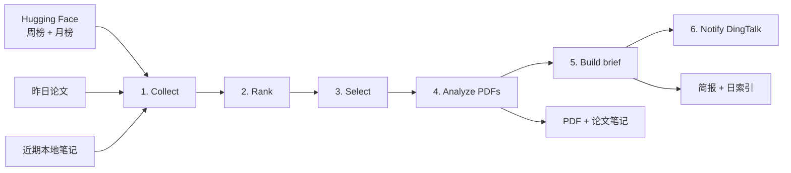

# 每日论文 Cookbook

[English](README.md)

每日论文是一个本地优先、文件原生的研究资讯工作流，用于把研究榜单转化为每日阅读材料。

## 能力

- 从 Hugging Face 周榜和月榜采集论文，并排除昨日论文和近期已经推荐过的论文。
- 对候选论文进行排序和精选，再使用 Claude Code 生成中文详细论文笔记和约五分钟可读完的中文简报。
- 将 PDF、笔记和记忆保存为由用户拥有的普通文件；索引和缓存均可重建。
- 支持每日定时运行、可选钉钉投递、对话记忆、auto-dream 整理，以及供后台钉钉 Agent 使用的 BM25 检索。

工作流由 [`daily_cookbook.yaml`](../../reme/config/daily_cookbook.yaml) 装配，公共 schema 位于
[`reme/schema/daily_paper.py`](../../reme/schema/daily_paper.py)，各步骤位于
[`reme/steps/cookbook/daily_paper/`](../../reme/steps/cookbook/daily_paper/)。

## 快速开始

每日论文要求 Python 3.11 或更高版本、`core` 依赖、可访问 Hugging Face 和 arXiv 的网络，以及所配置 Claude Code endpoint
的凭据。auto-memory 和 auto-dream 还需要 AgentScope LLM 凭据。

在仓库根目录运行：

```bash
python -m pip install -e ".[core]"
export CLAUDE_CODE_API_KEY="your-api-key"
reme start config=daily_cookbook job=daily_paper
```

内置配置默认通过 DashScope 的 Anthropic 兼容 endpoint 使用 `qwen3.7-max`。如需使用其他兼容模型或服务商， 请覆盖
`CLAUDE_CODE_MODEL_NAME` 和 `CLAUDE_CODE_BASE_URL`。

以上配置足以生成论文笔记和每日简报。要使用 auto-memory 和 auto-dream，还需配置：

```bash
export LLM_API_KEY="your-api-key"
```

默认情况下，产物写入 ReMe 启动目录下的 `reme_workspace/`。

### 可选 SSH 代理

出站代理默认关闭。如需启用，请取消 `daily_cookbook.yaml` 中
`components.outbound_proxy.default` 的注释，配置免交互 SSH 认证，并设置：

```bash
export REME_PROXY_IP="your-ssh-proxy-host"
export REME_PROXY_ACCOUNT="your-ssh-account"
```

## 文件产物

一次成功运行会在 `workspace_dir` 下写入普通 PDF 和 Markdown 文件：

```text
reme_workspace/
├── daily/
│   ├── YYYY-MM-DD.md
│   └── YYYY-MM-DD/
│       ├── daily-paper-brief.md
│       ├── paper-<arxiv-id>.md
│       └── ...
├── resource/
│   └── papers/
│       ├── <arxiv-id>.pdf
│       └── ...
├── digest/
│   ├── personal/
│   ├── project/
│   ├── resource/
│   └── wiki/
├── metadata/
│   └── ... 派生 catalog、索引和缓存
└── mem_session/
    ├── agentscope/
    └── claude_config/
```

- `paper-<arxiv-id>.md` 是中文详细论文解读，其 YAML frontmatter 会链接原始 PDF 和论文页面。
- `daily-paper-brief.md` 是约五分钟可读完的中文简报，并包含每篇入选论文笔记的 wikilink。
- `daily/YYYY-MM-DD.md` 是从当日 Markdown 文件重建的派生日索引。
- `resource/papers/` 保存可复用的原始 PDF。
- `digest/` 保存持久的 auto-dream 产物，其中仍然是由用户拥有的普通 Markdown 文件。
- `metadata/` 和搜索缓存属于派生状态；`reindex` 会根据源文件重建 file store、BM25 索引和图。

论文笔记是推荐历史的事实来源：后续排重会读取其 frontmatter 中的 `arxiv_id`。日索引属于可重建的派生文件。 当前工作流不会另外写入运行
manifest。

## 工作流程



### 1. 采集与排重

Collect 会获取运行日所在 ISO week 的周榜、所在自然月的月榜，以及严格前一个自然日的 Hugging Face Daily Papers ID。周榜和月榜元数据按
arXiv ID 合并，同时保留两个榜单各自的展示排名。

随后，它会在配置的历史窗口内扫描 `daily/<prior-date>/paper-*.md`，排除笔记 frontmatter 中已有的 ID。如果排重后 没有任何可选论文，Job
会明确失败。

### 2. 候选排序

Rank 使用 reciprocal-rank fusion（RRF）：

```text
score = 1 / (rrf_k + monthly_rank)
      + weekly_weight / (rrf_k + weekly_rank)
```

论文缺少某个榜单排名时，该项贡献为零。候选按融合分、upvotes 和 arXiv ID 排序。有界候选池还会为标题或摘要命中 Agent
memory、memory retrieval、continual learning、context compression、knowledge graph、RAG 等记忆相关关键词的
论文保留若干位置。这个保留策略只是关键词启发式，不是语义分类器。

### 3. 精选论文

Claude Code 接收有界候选池，并返回结构化的 `PaperSelection`。实现要求恰好选择 `top_k` 个候选池内的唯一 ID， 且 rank
必须连续。输出不合法时，校验错误会反馈给 Agent 并重试一次；第二次仍不合法则 Job 失败。

### 4. 下载并解读 PDF

入选论文按顺序逐篇处理。每篇论文都会经过：

1. 校验当前支持的新版 arXiv ID 格式；
2. 下载并校验 PDF，或复用文件头为 `%PDF-` 的已有文件；
3. 使用 `pypdf` 提取文本、插入页码标记，并应用页数和字符数限制；
4. 请求 Claude Code 返回结构化的详细解读；
5. 写入规范化 frontmatter 和生成的 Markdown 正文。

当前提取器依赖可用的 PDF 文本层。扫描版或纯图片 PDF 会失败，因为没有 OCR fallback。提取内容超过配置限制时， 笔记会记录输入已被截断。

### 5. 生成简报与索引

Claude Code 会读取全部详细笔记并生成当日简报。代码会检查每篇源笔记的 wikilink；如有遗漏，会在写入前自动补齐。 随后，工作流根据当日
Markdown frontmatter 重建 `daily/YYYY-MM-DD.md`。

### 6. 可选的钉钉通知

最后一步会去掉 YAML frontmatter，把简报正文按顺序发送到每个已配置的钉钉群。未配置群会话 ID 时，该步骤无副作用
跳过。某个群发送失败不会阻止继续尝试其他群，所有发送完成后再汇总报告失败。

## 记忆与检索

独立配置按职责分离 agent wrapper：

- `daily_paper` 执行论文精选、解读和简报生成。它保留 Claude Code 的常规本地工具并禁用 `WebSearch`，但当前没有 配置记忆检索
  Job。
- `dingtalk_wait` 运行后台钉钉 Agent，并把 `memory_search` 作为可调用工具。
- `memory` 通过 AgentScope 执行 auto-memory 和 auto-dream 中依赖 LLM 的步骤。它禁用内置 shell 和文件工具； 记忆变更只能经过
  `daily_write`、`read`、`edit`、`write` 等更窄的 ReMe job。

内置配置的 `memory_search` 使用 BM25 检索 `daily/` 和 `digest/` 下的 Markdown。ReMe 的搜索步骤支持融合向量结果， 但本
cookbook 默认没有配置 embedding store，因此不会执行向量检索。`node_search` 是 auto-dream 内部使用的 digest 节点检索工具。

`index_update_loop` 会在服务启动时索引已有记忆文件，并持续监听这些目录的后续变化。修复派生 file store 或需要强制
完整重建索引时，可运行 `reindex`。`reindex` 不会删除源 Markdown 或 PDF。

`auto_memory` 根据调用方传入的对话消息和稳定 `session_id` 写入或更新一篇 daily note。`auto_dream` 扫描近期 daily
notes，把持久记忆单元整合到 `digest/`，并生成兴趣主题。这两个 job 在本 cookbook 中都是按需执行；当前没有配置 auto-dream
cron。钉钉 Agent 可以通过 `memory_search` 召回记忆，但对话结束后不会自动调用 `auto_memory`。

## 日期、重跑与幂等

- `date` 必须严格符合 `YYYY-MM-DD`。省略时使用应用配置时区中的今天；内置配置为 `Asia/Shanghai`。
- “昨日”表示 `date - 1 day`，不是模糊的最近 24 小时。
- `history_days` 只扫描此前的日期目录，不会把本次运行日纳入历史窗口。
- 如果 `daily/<date>/daily-paper-brief.md` 已存在且 `force=false`，采集、排序、模型调用、PDF 处理和简报生成都会
  跳过；已有简报仍会交给钉钉通知步骤。
- `force=true` 会重新生成笔记和简报，但仍会复用已有且有效的 PDF。

每个 PDF、详细笔记和最终简报都会先写临时文件再替换，避免读取方看到半写状态。整个多文件工作流不是事务， 同一日期的并发运行也没有全局锁。

## 运行方式

独立配置中的主要 Job 如下：

| Job                 | 行为                                                          |
|---------------------|---------------------------------------------------------------|
| `daily_paper`       | 通过 CLI 或 HTTP 服务按需生成                                 |
| `daily_paper_cron`  | 每天 08:00（`Asia/Shanghai`）执行相同 pipeline                |
| `dingtalk_wait`     | 由 supervisor 管理、具有 `memory_search` 能力的后台钉钉 Agent |
| `auto_memory`       | 根据对话消息写入或更新 daily note                             |
| `auto_dream`        | 把近期 daily notes 整理为 digest 记忆和兴趣主题               |
| `memory_search`     | 对 daily 和 digest Markdown 执行 BM25 检索                    |
| `reindex`           | 根据已有记忆文件重建派生检索状态                              |
| `index_update_loop` | 在服务模式下初始化并持续更新检索状态                          |

`node_search`、`daily_list`、`daily_write`、`read`、`write`、`edit` 和 frontmatter 更新等辅助 job 构成 memory agent 使用的受约束工具。

### 一次性运行

快速开始中的命令会生成今天的简报。要生成指定日期并覆盖部分参数：

```bash
reme start \
  config=daily_cookbook \
  job=daily_paper \
  date=2026-07-21 \
  top_k=3 \
  history_days=30
```

重新生成已有简报的日期：

```bash
reme start config=daily_cookbook job=daily_paper date=2026-07-21 force=true
```

需要查看响应 metadata 进行诊断时，可在一次性命令中加入 `service.show_metadata=true`。

### 常驻服务与 cron

启动独立 HTTP 服务以及定时、后台 Job：

```bash
reme start config=daily_cookbook
```

服务默认监听 `127.0.0.1:8001`，因此可以和默认 ReMe 服务并行运行。在另一个终端中通过 ReMe client 或 HTTP 调用按需任务：

```bash
reme daily_paper host=127.0.0.1 port=8001
```

```bash
curl -s http://127.0.0.1:8001/daily_paper \
  -H 'Content-Type: application/json' \
  -d '{"date":"2026-07-21","top_k":3,"force":false}'
```

检索记忆、记录对话、整理记忆，或显式重建检索索引：

```bash
reme memory_search host=127.0.0.1 port=8001 query="agent memory" limit=5

reme auto_memory host=127.0.0.1 port=8001 \
  session_id=example-session \
  messages='[{"name":"user","role":"user","content":"I prefer concise paper summaries."}]'

reme auto_dream host=127.0.0.1 port=8001 date=2026-07-21
reme reindex host=127.0.0.1 port=8001
```

监听地址和调度时间可以在启动时覆盖：

```bash
reme start \
  config=daily_cookbook \
  service.host=0.0.0.0 \
  service.port=8101 \
  jobs.daily_paper_cron.cron="30 7 * * *"
```

## 配置

最常用的 Job 配置如下：

| 配置项            |     默认值 | 用途                               |
|-------------------|-----------:|------------------------------------|
| `candidate_limit` |       `20` | 送入精选阶段的最大论文数           |
| `memory_reserve`  |        `5` | 记忆关键词启发式保留的候选位置数   |
| `top_k`           |        `3` | 最终精选和解读的论文数             |
| `rrf_k`           |       `60` | RRF 常数                           |
| `weekly_weight`   |      `0.7` | 周榜在融合排序中的权重             |
| `history_days`    |       `30` | 按 arXiv ID 排除近期推荐的时间窗口 |
| `hf_timeout`      |    `30` 秒 | Hugging Face 请求 timeout          |
| `hf_max_retries`  |        `3` | Hugging Face 请求最多尝试次数      |
| `pdf_timeout`     |    `90` 秒 | arXiv 下载 timeout                 |
| `max_pdf_bytes`   | `52428800` | PDF 大小上限（50 MiB）             |
| `max_pdf_pages`   |       `80` | 最多提取的 PDF 页数                |
| `max_pdf_chars`   |   `240000` | 单篇论文送入模型的最大提取字符数   |

公开 Job 参数为 `date`、`force`、`top_k`、`weekly_weight` 和 `history_days`。调用时显式传入的值优先于 Job 默认值。

独立应用还支持以下环境变量：

| 环境变量                                | 用途                                   |
|-----------------------------------------|----------------------------------------|
| `DAILY_PAPER_WORKSPACE_DIR`             | 覆盖默认 `reme_workspace`              |
| `DAILY_PAPER_PROJECT_PATH`              | Claude Code 可见的仓库或项目路径       |
| `REME_PROXY_IP`                         | 可选 SSH 代理主机                      |
| `REME_PROXY_ACCOUNT`                    | 可选 SSH 代理账户                      |
| `DAILY_PAPER_HOST` / `DAILY_PAPER_PORT` | HTTP 监听地址                          |
| `CLAUDE_CODE_API_KEY`                   | Claude Code endpoint 的 API key        |
| `CLAUDE_CODE_MODEL_NAME`                | Claude Code 模型；默认 `qwen3.7-max`   |
| `CLAUDE_CODE_BASE_URL`                  | Claude Code 的 Anthropic 兼容 endpoint |
| `LLM_API_KEY`                           | AgentScope memory 模型的 API key       |
| `LLM_MODEL_NAME`                        | memory 模型；默认 `qwen3.7-max`        |
| `LLM_BASE_URL`                          | memory 模型的 Anthropic 兼容 endpoint  |

`DAILY_PAPER_PROJECT_PATH` 默认是相对于 workspace 的 `..`。使用默认 `reme_workspace` 并从仓库根目录启动时， 它会解析回仓库根目录。如果
workspace 位于其他位置，请显式设置这两个路径。

ReMe 会从当前目录向上查找未提交的 `.env`，因此也可以把相同变量放在其中，而不是在 shell 中导出。

## 钉钉配置

钉钉是可选能力。仅在需要投递简报或运行后台钉钉 Agent 时配置：

```dotenv
DINGTALK_APP_KEY=your-app-key
DINGTALK_APP_SECRET=your-app-secret
DINGTALK_ROBOT_CODE=your-robot-code
DINGTALK_CONVERSATION_IDS=cid-group-one,cid-group-two
```

只有主动投递简报需要 `DINGTALK_CONVERSATION_IDS`。后台 `dingtalk_wait` Job 使用前三项凭据，不使用群会话列表。

## 故障恢复与边界

| 场景                       | 当前行为                                     |
|----------------------------|----------------------------------------------|
| Hugging Face 暂时失败      | 按指数间隔重试，最多尝试 `hf_max_retries` 次 |
| 没有 eligible 论文         | 在排序前失败                                 |
| `top_k` 或精选结果不合法   | 校验后失败；精选结果可重试一次               |
| PDF 太大、无效或没有文本层 | 在解读阶段停止                               |
| PDF 超过页数或字符数限制   | 使用截断文本继续，并记录截断状态             |
| 某篇论文解读失败           | Job 停止；此前写入的 PDF 和笔记保留          |
| 简报遗漏源笔记链接         | 写入前自动补齐 wikilink                      |
| auto-dream 部分整合失败    | 成功单元保留，失败路径不会被 checkpoint      |

恢复时，先检查该日期已有的笔记和 PDF，修复网络、凭据、模型或 PDF 问题，再使用相同日期和 `force=true` 重跑。 有效的缓存 PDF
会被复用。

内置 Claude Code 组件使用 `permission_mode: bypassPermissions`，并禁用 `WebSearch`。`dingtalk_wait` 可以调用本地
`memory_search`；`daily_paper` 当前没有配置 Job 工具。Analyze 和 Brief prompt 会限制 Agent 应读取的内容，但这些
步骤没有设置严格的逐次调用工具 allowlist，也不是操作系统级沙箱。AgentScope memory wrapper 禁用了内置 shell 和 文件系统工具，但其
ReMe job tools 运行于 bypass permission mode。请只在可信的项目和 workspace 中运行；用于共享 或生产环境前，应进一步收紧配置。

## 测试

聚焦的单元测试会 mock Hugging Face、arXiv、Claude Code 和钉钉边界：

```bash
python -m pip install -e ".[dev,core]"
pytest tests/unit/test_daily_paper.py -v
```

真实运行会访问外部服务并可能产生模型费用，不应把它当作普通单元测试执行。
