# ReMe Framework

## 1. Overview

The ReMe runtime can be understood as follows: **a configuration-driven Application assembles components and Jobs; the
Service exposes service-enabled Jobs to the CLI, HTTP, or MCP; and each Job executes its Steps in sequence**.

<p align="center">
  
</p>

To run and use ReMe first, see [Quick Start](./quick_start.md). For workspace file semantics, see
[Memory as File](./memory_as_file.md). User-facing guides for retrieval, automatic memory, and proactive reading are
[Memory Search](./memory_search.md), [Auto Memory](./auto_memory.md), [Auto Resource](./auto_resource.md),
[Auto Dream](./auto_dream.md), and [Proactive](./proactive.md).

### Capability Boundary

ReMe v4 focuses on long-term memory: it distills conversations and resources into `daily/`, organizes them into `digest/`,
and exposes write, retrieval, and proactive-read capabilities through the CLI, HTTP, and MCP.

Single-session context-window management is outside the scope of ReMe v4. This includes compressing the current conversation,
injecting summaries, trimming tool output, or providing an independent `/compact` interface. Those capabilities belong in
the host agent framework. ReMe accepts conversations, resources, and file changes that have already occurred and persists the
information with long-term value.

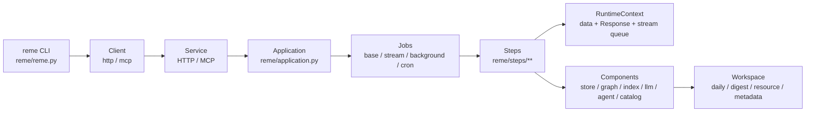

Core layers:

| Layer | Main location | Responsibility |
|---|---|---|
| CLI | `reme/reme.py` | Parse commands; `start` launches the service; other actions call the service through a client. |
| Service | `reme/components/service/` | Register Jobs as HTTP endpoints or MCP tools. |
| Application | `reme/application.py` | Assemble configured objects, start them in dependency order, close them, and invoke Jobs. |
| Job | `reme/components/job/` | Orchestrate Steps and select normal, streaming, background, or scheduled execution. |
| Step | `reme/steps/` | Atomic business operations such as file I/O, retrieval, indexing, and self-evolution. |
| Component | `reme/components/` | Reusable infrastructure such as file_store, file_graph, keyword_index, and agent_wrapper. |
| Schema | `reme/schema/` | Data structures such as `Request`, `Response`, `FileChunk`, `FileNode`, and configuration models. |
| Config | `reme/config/` | Default YAML configuration and command-line override parsing. |

## 2. Directory Structure

```text
reme/
  reme.py                    # CLI entry point
  application.py             # Application assembly and lifecycle
  config/
    default.yaml             # default service / jobs / components
    config_parser.py         # config=, dot notation, and env placeholder parsing
  components/
    component_registry.py    # global registry R
    base_component.py        # ComponentMixin / BaseComponent / bind dependency declarations
    runtime_context.py       # context for one Job execution
    job/                     # BaseJob / StreamJob / BackgroundJob / CronJob
    service/                 # HTTP / MCP services
    client/                  # HTTP / MCP clients
    file_store/              # file-index coordination layer
    file_graph/              # wikilink graph
    keyword_index/           # BM25 and other keyword indexes
    file_chunker/            # Markdown / default text chunking
    file_catalog/            # change checkpoints
    as_llm/, as_embedding/   # model wrappers
    agent_wrapper/           # AgentScope / Claude Code wrappers
  steps/
    base_step.py             # BaseStep, Ref, dispatch_steps
    common/                  # version, help, health_check, demo
    file_io/                 # read/write/edit/delete/move/frontmatter/daily
    index/                   # watch/init/update/search/traverse
    evolve/                  # auto_memory, auto_resource, auto_dream, proactive
    transfer/                # upload/download/ingest
    channel/                 # MCP channel tools
```

The default workspace directories are defined by `ApplicationConfig`:

```text
<workspace_dir>/
  metadata/     # persistent file_store, file_graph, keyword_index, file_catalog, and related state
  session/      # agent sessions and original conversations
  resource/     # external resources
  daily/        # lightly processed memory
  digest/       # long-term digest memory
```

`Application.__init__()` first ensures that these directories exist, then initializes the service, components, and Jobs.

## 3. Startup and Call Chain

### 3.1 CLI

The entry point is `reme/reme.py::main()`:

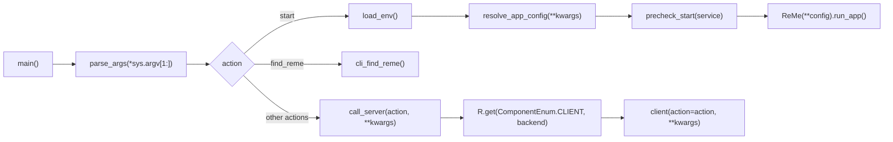

Common commands:

```bash
reme start
reme start service.port=8181
reme version
reme search query="memory" limit=5
reme search query="memory" backend=mcp
```

Configuration parsing supports:

| Capability | Source | Description |
|---|---|---|
| Default configuration | `resolve_app_config()` | Load `reme/config/default.yaml` when `config` is not specified. |
| Explicit configuration | `config=<name-or-path>` | Accept a built-in configuration name or a YAML/JSON file path. |
| Dot notation | `parse_dot_notation()` | For example, `service.port=8181`. |
| Environment variables | `_expand_env_vars()` | Support `${VAR}` and `${VAR:-default}`. |
| Value conversion | `_convert_value()` | Convert bool, int, float, JSON list/dict, and null values automatically. |

### 3.2 Service

`BaseService.run_app()` executes in this order:

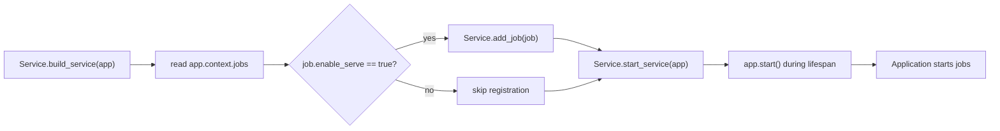

HTTP service behavior:

| Job type | HTTP exposure |
|---|---|
| Non-`StreamJob` with `enable_serve: true` | `POST /<job.name>` returning `Response` JSON. |
| `StreamJob` | `POST /<job.name>` returning `text/event-stream`. |
| `enable_serve: false` | No endpoint is registered. |

MCP service behavior:

| Job type | MCP exposure |
|---|---|
| Non-`StreamJob` with `enable_serve: true` | Registered as an MCP tool. |
| `StreamJob` | Currently skipped and not registered. |
| `BackgroundJob` | Forces `enable_serve=False` at construction and is never exposed. |

## 4. Registry and Dependency Injection

### 4.1 Global Registry R

ReMe uses the process-wide singleton `R = ComponentRegistry()`. Every component, Job, and Step is registered with
`@R.register("name")`.

```python
from ...components import R


@R.register("version_step")
class VersionStep(BaseStep):
    ...
```

The registry key is:

```text
(component_type, register_name) -> class
```

`component_type` comes from a class attribute:

| Type | Class attribute |
|---|---|
| Step | `BaseStep.component_type = ComponentEnum.STEP` |
| Job | `BaseJob.component_type = ComponentEnum.JOB` |
| Service | `BaseService.component_type = ComponentEnum.SERVICE` |
| FileStore | `BaseFileStore.component_type = ComponentEnum.FILE_STORE` |

The same backend name can therefore exist under different component types. For example, `http` can be both a service backend
and a client backend.

### 4.2 Registration Through Module Imports

Registration happens when a module is imported. `reme/components/__init__.py` imports component packages, while
`reme/steps/__init__.py` imports `channel/common/evolve/file_io/index/transfer`. Each package's `__init__.py` then imports
its concrete modules, causing `@R.register(...)` to execute.

After adding a Step file, make sure the package's `__init__.py` imports it. Otherwise, the backend will not appear in the
registry.

### 4.3 Component.bind

Dependencies between components are declared with `BaseComponent.bind()`. At startup,
`Application._topological_order()` reads every component's `dependencies` and starts them in topological order.

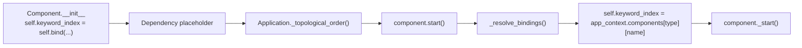

Rules for `BaseComponent.bind(name, BaseClass, optional=True)`:

| Scenario | Behavior |
|---|---|
| `name` is empty | Return `None` and skip the dependency. |
| `app_context` exists | Look up `app_context.components[ctype][name]`. |
| Dependency missing and `optional=True` | Resolve to `None`. |
| Dependency missing and `optional=False` | Fail at startup. |
| Standalone mode | A private component can be created with `default_factory`. |

### 4.4 Step.Ref

Steps do not participate in component topological startup. They are created temporarily for each Job invocation. Steps access
components primarily through `BaseStep.Ref`:

```python
file_store: BaseFileStore = Ref(BaseFileStore, ComponentEnum.FILE_STORE)
agent_wrapper: BaseAgentWrapper = Ref(BaseAgentWrapper, ComponentEnum.AGENT_WRAPPER, optional=True)
```

Resolution priority:

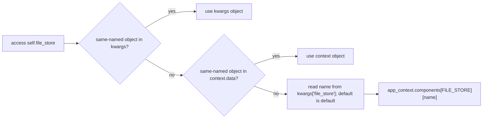

A Step configuration can therefore specify:

```yaml
steps:
  - backend: update_catalog_step
    file_catalog: resource
```

Here, `file_catalog: resource` means to resolve the `file_catalog` component named `resource`.

## 5. Application Lifecycle

The Application converts configuration into runtime objects and starts and closes them in order.

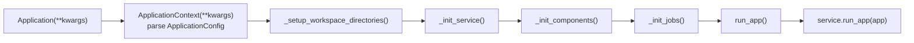

Startup order in `Application._start()`:

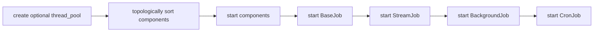

During shutdown, objects in `_started_components` are closed in reverse order so dependents close before their dependencies.

## 6. Job Model

A Job is the orchestration unit for an externally callable capability or background task. Jobs are configured under `jobs:`
in `reme/config/default.yaml`.

### 6.1 BaseJob

`BaseJob` is the most common request-oriented Job:

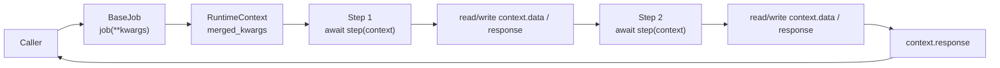

Important source behavior:

| Source | Behavior |
|---|---|
| `_start()` | Parse each Step config from YAML into `(step_cls, params)`. |
| `_build_steps()` | Create new Step instances for every call, avoiding state shared across requests. |
| `__call__()` | Create a `RuntimeContext` and execute Steps sequentially. |
| Exception handling | Catch the exception, set `response.success=False`, and set `answer=str(e)`. |

### 6.2 StreamJob

`StreamJob` extends `BaseJob` but returns streaming chunks:

| Behavior | Description |
|---|---|
| Context | Includes `stream_queue`. |
| Step output | Call `context.add_stream_string(text, ChunkEnum.CONTENT)`. |
| Exception | Write `ChunkEnum.ERROR`. |
| Completion | Always send a `DONE` chunk. |

### 6.3 BackgroundJob

`BackgroundJob` runs long-lived loops such as file watchers. Its constructor forces `enable_serve=False`.

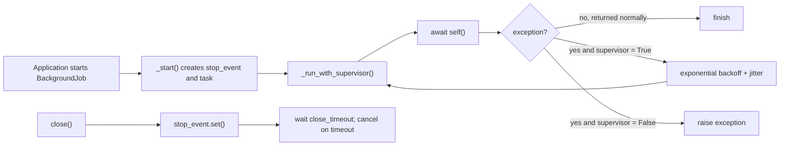

The default `BackgroundJob.__call__()` also executes configured Steps in sequence, but it does not swallow exceptions, which
allows the supervisor to restart the task.

### 6.4 CronJob

`CronJob` extends `BackgroundJob` with a `cron` expression:

```yaml
jobs:
  nightly_dream:
    backend: cron
    cron: "0 3 * * *"
    steps:
      - backend: dream_extract_step
      - backend: dream_integrate_step
      - backend: dream_topics_step
      - backend: dream_finish_step
```

The current implementation uses `croniter` to calculate the next trigger time. The timezone comes from
`app_config.timezone`.

### 6.5 Default Job Types

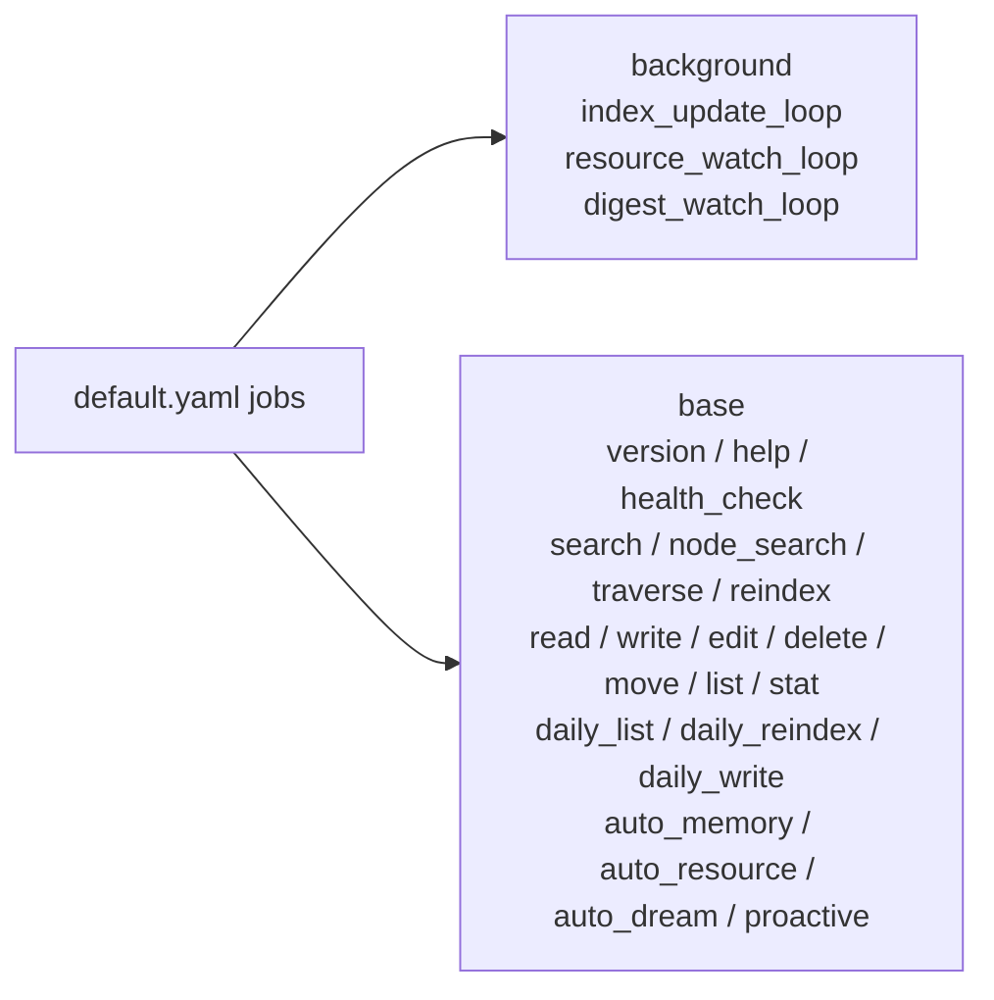

## 7. Step Model

A Step is a concrete business action. Every Step extends `BaseStep` and implements `execute()`.

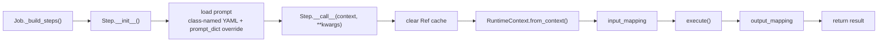

### 7.1 RuntimeContext

`RuntimeContext` is shared by all Steps within one Job invocation:

| Field | Description |
|---|---|
| `response` | Final `Response(answer, success, metadata)`. |
| `data` | Free-form dictionary containing input parameters and intermediate results. |
| `stream_queue` | Output queue for streaming Jobs. |
| `stop_event` | Stop signal for background Jobs. |

Common Step code:

```python
assert self.context is not None
query = self.context.get("query", "")
self.context["processed_query"] = query.strip().lower()
self.context.response.answer = "..."
self.context.response.metadata["key"] = "value"
return self.context.response
```

### 7.2 input_mapping / output_mapping

`BaseStep.__call__()` invokes `RuntimeContext.apply_mapping()` before and after execution:

```yaml
steps:
  - backend: some_step
    input_mapping:
      user_query: query
    output_mapping:
      result: final_result
```

The semantics are to copy `context.data[source]` to `context.data[target]`.

### 7.3 dispatch_steps

Some Steps produce batches of events and dispatch them to other Steps. `BaseStep.dispatch_steps()` resolves and executes
child Steps according to configuration.

Example from the default configuration:

```yaml
index_update_loop:
  backend: background
  watch_dirs: [ daily_dir, digest_dir ]
  watch_suffixes: [ md ]
  steps:
    - backend: init_changes_step
      monitor_type: file_store
      monitor_name: default
      dispatch_steps: [ update_index_step ]
    - backend: watch_changes_step
      dispatch_steps: [ update_index_step ]
```

Flow:

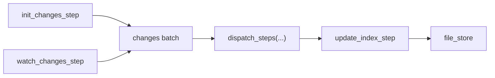

## 8. Components in the Default Configuration

Current default components in `reme/config/default.yaml`:

| ComponentEnum | Name | Backend | Description |
|---|---|---|---|
| `service` | singleton | `http` | Default HTTP service. |
| `tokenizer` | `default` | `regex` | BM25 tokenizer. |
| `as_embedding` | `default` | `${EMBEDDING_BACKEND:-openai}` | Embedding model wrapper. |
| `embedding_store` | `default` | `local` | Embedding store depending on `as_embedding: default`. |
| `as_llm` | `default` | `${LLM_BACKEND:-openai}` | LLM model wrapper. |
| `agent_wrapper` | `default` | `agentscope` | AgentScope wrapper. |
| `agent_wrapper` | `claude_code` | `claude_code` | Claude Code wrapper. |
| `file_graph` | `default` | `local` | Wikilink graph. |
| `file_catalog` | `default/resource/digest/dream` | `local` | File-change checkpoints. |
| `file_chunker` | `markdown` | `markdown` | Markdown AST chunking. |
| `file_chunker` | `default` | `default` | Default text chunking, currently supporting `jsonl`. |
| `keyword_index` | `default` | `bm25` | BM25 keyword index. |
| `file_store` | `default` | `local` | Combines file_graph and keyword_index; defaults to `embedding_store: ""`. |

Note that the `search` Step configuration contains `vector_weight`, but `file_store.default.embedding_store` is empty by
default. Vector retrieval is available only when the runtime configuration enables an embedding store.

## 9. Adding a Step

### 9.1 Minimal Step

Suppose you want to add a Step that converts input text to uppercase.

Create a file such as `reme/steps/common/uppercase.py`:

```python
from ..base_step import BaseStep
from ...components import R


@R.register("uppercase_step")
class UppercaseStep(BaseStep):
    async def execute(self):
        assert self.context is not None
        text = self.context.get("text", "")
        result = str(text).upper()

        self.context["uppercase_text"] = result
        self.context.response.answer = result
        self.context.response.metadata["length"] = len(result)
        return self.context.response
```

### 9.2 Registering the Step

Make sure `reme/steps/common/__init__.py` imports the new module. Add:

```python
from . import uppercase
```

The reason is that `@R.register("uppercase_step")` only executes after the module is imported.

### 9.3 Accessing Components

If a Step needs an existing component, prefer the Refs provided by `BaseStep`:

```python
class MySearchStep(BaseStep):
    async def execute(self):
        assert self.context is not None
        results = await self.file_store.keyword_search(
            self.context.get("query", ""),
            limit=5,
        )
        ...
```

Common attributes available directly:

| Attribute | Component resolved by default |
|---|---|
| `self.as_llm` | `.model` from `as_llm: default`. |
| `self.agent_wrapper` | `agent_wrapper: default`; optional. |
| `self.file_catalog` | `file_catalog: default`; optional. |
| `self.file_store` | `file_store: default`. |

To select a non-default component from Job configuration:

```yaml
steps:
  - backend: my_step
    file_catalog: dream
```

### 9.4 Step Design Guidance

| Guidance | Reason |
|---|---|
| Read input from `context` and write intermediate results to `context`. | A multi-Step Job passes data through the same context. |
| Write the final result to `context.response`. | Services and clients consume the standard `Response`. |
| Do not store request-scoped state on a Step instance. | A Step is rebuilt for every Job call, and stateless Steps are easier to test. |
| A background loop that supports interruption should check `context.stop_event`. | `BackgroundJob.close()` relies on the stop event for graceful shutdown. |
| Call `add_stream_string()` only from a StreamJob. | A normal Job has no stream queue. |

### 9.5 Unit Test Example

A Step can be instantiated directly and passed a `RuntimeContext`:

```python
import pytest

from reme.components.runtime_context import RuntimeContext
from reme.steps.common.uppercase import UppercaseStep


@pytest.mark.asyncio
async def test_uppercase_step():
    ctx = RuntimeContext(text="hello")
    resp = await UppercaseStep()(ctx)
    assert resp.answer == "HELLO"
    assert ctx["uppercase_text"] == "HELLO"
```

## 10. Adding a Job

A Job usually requires no new Python class; configure existing Steps instead. Add a new Job backend only when a new execution
model is required.

### 10.1 Adding a Normal Request Job

Add the Job under `jobs:` in a YAML configuration:

```yaml
jobs:
  uppercase:
    backend: base
    description: "Convert text to uppercase."
    parameters:
      type: object
      properties:
        text:
          type: string
          description: "input text"
      required:
        - text
    steps:
      - backend: uppercase_step
```

Start and call it:

```bash
reme start
reme uppercase text="hello"
```

Call chain:

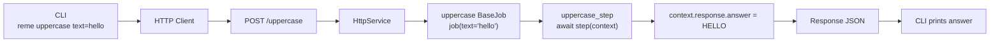

### 10.2 Adding a Multi-Step Job

A Job can chain multiple Steps:

```yaml
jobs:
  demo_echo:
    backend: base
    description: "Normalize query, then echo it."
    parameters:
      type: object
      properties:
        query:
          type: string
          default: ""
        min_score:
          type: number
          default: 0.5
    steps:
      - backend: demo_echo_step1
      - backend: demo_echo_step2
```

The first Step writes:

```text
context["processed_query"]
context["adjusted_min_score"]
```

The second Step reads those fields and writes the final `response`.

### 10.3 Adding a Stream Job

Use `backend: stream` in configuration:

```yaml
jobs:
  stream_uppercase:
    backend: stream
    description: "Stream uppercase text."
    parameters:
      type: object
      properties:
        text:
          type: string
      required:
        - text
    steps:
      - backend: uppercase_prepare_step
      - backend: uppercase_stream_step
```

Example streaming Step:

```python
from ..base_step import BaseStep
from ...components import R
from ...enumeration import ChunkEnum


@R.register("uppercase_stream_step")
class UppercaseStreamStep(BaseStep):
    async def execute(self):
        assert self.context is not None
        for ch in self.context.get("uppercase_text", ""):
            await self.context.add_stream_string(ch, ChunkEnum.CONTENT)
        return self.context.response
```

### 10.4 Adding a Background Job

Use `backend: background` in configuration:

```yaml
jobs:
  my_watch_loop:
    backend: background
    watch_dirs: [ daily_dir ]
    watch_suffixes: [ md ]
    steps:
      - backend: init_changes_step
        monitor_type: file_store
        monitor_name: default
        dispatch_steps: [ update_index_step ]
      - backend: watch_changes_step
        dispatch_steps: [ update_index_step ]
```

Characteristics of a background Job:

| Characteristic | Description |
|---|---|
| Not externally exposed | `BackgroundJob.__init__()` forces `enable_serve=False`. |
| Has a supervisor | Restarts with exponential backoff after an exception by default. |
| Has a stop event | Notifies the loop to exit during close. |
| Suitable for watching/consuming | File watching, queue consumption, and periodic long-running loops. |

### 10.5 Adding a Cron Job

Use `backend: cron` in configuration:

```yaml
jobs:
  daily_auto_dream:
    backend: cron
    cron: "30 3 * * *"
    steps:
      - backend: dream_extract_step
        file_catalog: dream
      - backend: dream_integrate_step
      - backend: dream_topics_step
      - backend: dream_finish_step
        file_catalog: dream
```

An invalid `cron` expression fails at startup.

### 10.6 When a New Job Backend Is Needed

Most use cases require only a new Step plus a YAML Job. Consider adding `reme/components/job/*.py` only in these cases:

| Requirement | New Job class? |
|---|---|
| Add a business command | No; use `backend: base`. |
| Chain existing steps | No; use `steps:`. |
| Need SSE/streaming output | No; use `backend: stream`. |
| Need a background loop | No; use `backend: background`. |
| Need cron scheduling | No; use `backend: cron`. |
| Need entirely new scheduling, concurrency, or transaction semantics | Yes; add a Job backend. |

Minimal shape of a new Job backend:

```python
from .base_job import BaseJob
from ..component_registry import R


@R.register("my_job_backend")
class MyJob(BaseJob):
    async def __call__(self, **kwargs):
        # custom scheduling logic
        return await super().__call__(**kwargs)
```

Also ensure the module is imported by `reme/components/job/__init__.py`.
