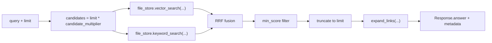

# Memory Search

Memory Search is ReMe's memory retrieval entry point. It continuously builds files under `daily/`, `digest/`, and `resource/`
into a searchable chunk index and wikilink graph. At query time, it first recalls the most relevant fragments and then expands
context along the bidirectional links of the files containing those fragments.

<p align="center">
  
</p>

For the general semantics of file layers, frontmatter, wikilinks, and chunking, see
[Memory as File](./memory_as_file.md). This page focuses on index maintenance and query execution.

```text
workspace files
  ├─ index_update_loop: detect added / modified / deleted
  ├─ update_index_step: file -> FileNode + FileChunk[]
  ├─ file_store: store chunks, BM25, optional embeddings, and the wikilink graph
  └─ search_step: BM25 / vector recall -> RRF fusion -> link expansion
```

## What It Searches

The default `index_update_loop` watches three memory directories:

- `daily_dir`: daily working memory and session memory cards generated by Auto Memory.
- `digest_dir`: long-term distilled digest nodes.
- `resource_dir`: external resources or imported material.

The default suffixes are `md` and `jsonl`. Markdown uses the `markdown` chunker, which parses frontmatter, heading structure,
and `[[wikilinks]]`. JSONL uses the `default` chunker and creates overlapping chunks by byte size.

## How the Index Is Built

The background Job `index_update_loop` maintains the index using configuration from `reme/config/default.yaml`:

```yaml
index_update_loop:
  backend: background
  watch_dirs: [ daily_dir, digest_dir, resource_dir ]
  watch_suffixes: [ md, jsonl ]
  steps:
    - backend: init_changes_step
      monitor_type: file_store
      monitor_name: default
      dispatch_steps: [ update_index_step ]
    - backend: watch_changes_step
      dispatch_steps: [ update_index_step ]
```

`init_changes_step` runs at startup. It scans the watched directories, compares file mtimes on disk with
`FileNode.st_mtime` values already stored in `file_store`, calculates added, modified, and deleted changes, and passes
`context["changes"]` to `update_index_step`.

While the service is running, `watch_changes_step` takes over. It uses `watchfiles.awatch()` to watch the same directories,
groups file events within a quiet window, and uses `coalesce_changes()` to collapse repeated events for the same path into one
stable batch of changes.

`update_index_step` performs the actual index writes:

1. Select a file chunker by suffix.
2. Parse the file into one `FileNode` and multiple `FileChunk` objects.
3. For an added or modified file, delete its old chunks before upserting the new chunks.
4. For a deleted file, remove its records from `file_store`, `keyword_index`, and `file_graph`.
5. When changes exist, dump state to `metadata/` so it can be restored on the next startup.

The Markdown chunker parses YAML frontmatter, heading structure, and `[[...]]` into `FileNode`, `FileChunk`, and `FileLink`
objects. For detailed chunking rules, see [Memory as File](./memory_as_file.md#memory-chunking).

## What file_store Contains

The default `file_store.default` backend is `local`:

```yaml
file_store:
  default:
    backend: local
    embedding_store: ""
    keyword_index: default
    file_graph: default
```

It combines three kinds of capability:

| Part | Default state | Purpose |
|---|---|---|
| `file_chunks` | Enabled | Store `FileChunk` text, line numbers, scores, and optional embeddings. |
| `keyword_index.default` | Enabled | BM25 inverted index where chunk ID is the document ID. |
| `file_graph.default` | Enabled | Store `FileNode` objects and wikilink edges. |
| `embedding_store` | Disabled | When enabled, generate embeddings for chunks and support vector recall. |

Out of the box, search therefore uses primarily BM25 plus link expansion. After setting `embedding_store: default`,
`SearchStep` runs vector and keyword recall together.

## How to Search

The `search` Job is also configured in `default.yaml`:

```yaml
search:
  backend: base
  description: "Hybrid workspace search (vector + BM25, RRF-fused)."
  parameters:
    query: string
    limit: integer
    min_score: number
  steps:
    - backend: search_step
      vector_weight: 0.7
      candidate_multiplier: 3.0
      expand_links: true
      max_links_per_direction: 10
```

Call it with:

```bash
reme search query="recent discussions about indexing" limit=5
```

`search_step` executes in this order:



If only BM25 has results, the BM25 ranking is returned directly. If only vector search has results, the vector ranking is
returned directly. When both have results, they are fused with RRF. RRF does not compare BM25 and cosine scores directly; it
compares ranks in the two result lists:

```text
fused_score = vector_weight / (60 + vector_rank)
            + keyword_weight / (60 + keyword_rank)
```

The default `vector_weight=0.7` gives semantic recall more weight when embeddings are enabled, while keyword search can still
promote chunks with exact term matches.

## How BM25 Works

`keyword_search()` calls `keyword_index.retrieve(query, limit)`. Each chunk is a document in the BM25 index:

- `doc_id` is `FileChunk.id`.
- `content` is `FileChunk.text`.
- The tokenizer splits text into tokens.
- The inverted index records which chunks contain each token and its term frequency within each chunk.
- A query scores only the posting lists matching its tokens and returns the highest-scoring chunk IDs.

When a file changes, `LocalFileStore.upsert()` first removes the BM25 documents corresponding to the file's old `chunk_ids`
and then adds the new chunk text. Deletion is lazy; the index can later be compacted with optimize.

## Progressive Expansion

"Progressive" in Memory Search does not mean putting the entire repository into one result. Retrieval expands in three layers:

1. Chunk recall: return only the `limit` most relevant text fragments.
2. File location: each result includes `path:start_line-end_line`, allowing the caller to read the source precisely with `read`.
3. Link neighbors: call `expand_links()` for each matched file and expand at most `max_links_per_direction` outlinks and
   inlinks.

Expansion data comes from `file_graph` rather than rescanning files:

```text
matched chunk
  -> chunk.path
  -> file_store.get_outlinks(path)
  -> file_store.get_inlinks(path)
  -> file_store.get_nodes(neighbor_paths)
  -> render neighbor path, name, description, predicate, and anchor
```

This keeps search results short while still showing which long-term nodes, resources, or other daily notes a memory connects
to. If a result is worth pursuing, use `read path=...` to open the source or
`traverse path=... depth=2` to continue along the wikilink graph.

## Return Format

`SearchStep` writes results in two places:

- `response.answer`: human-readable text. Each matched block contains its path, line numbers, score, and chunk content,
  followed by outlinks and inlinks.
- `response.metadata`: structured programmatic results containing `results`, `link_expansion`, and `counts`.

Typical text structure:

```text
========== daily/2026-06-20/session-a.md:12-28 [score=0.0317 keyword=4.8120] ==========
...matched memory fragment...
  outlinks (2):
    -> digest/indexing.md  name="Indexing"  description="..."
      via predicate=related
  inlinks (1):
    <- daily/2026-06-19.md  name="..."
      via plain
```

`counts` reports how many vector and keyword candidates were recalled and how many results were ultimately returned. With
embeddings disabled by default, `vector` is usually `0` and `hybrid` is `false`.
